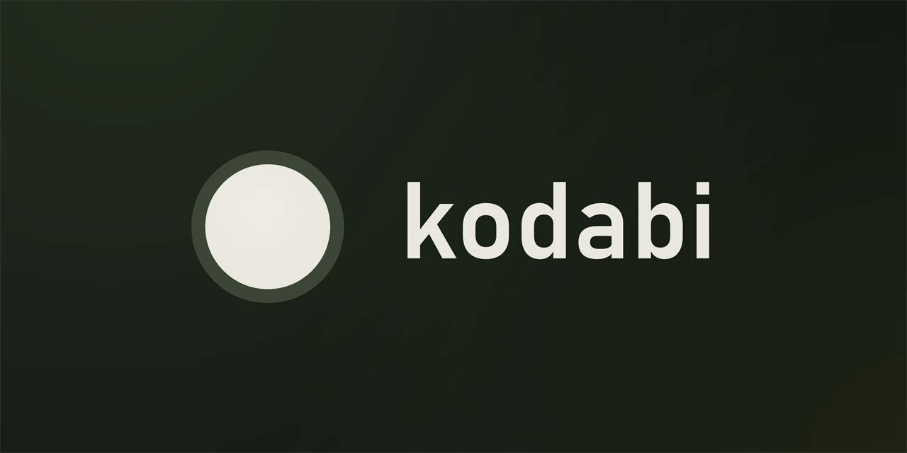
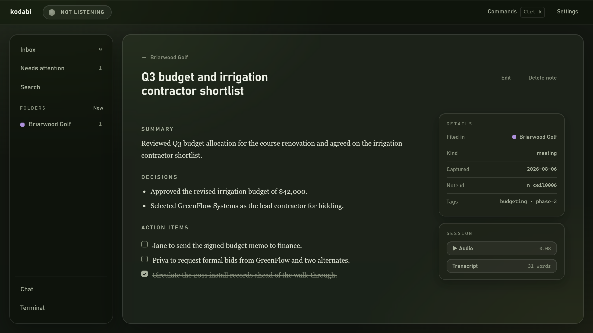

<p align="center">
  
</p>

<p align="center">
  <strong>A self-organizing personal knowledge base.</strong><br>
  Kodabi turns meeting transcripts and quick notes into a searchable knowledge base. Recordings are
  transcribed on your device, distilled into Markdown notes, and routed into your vault
  automatically: <strong>transcribe → distill → auto-route → search &amp; chat</strong>.
</p>

<p align="center">
  <a href="https://github.com/ShaneHoffman/kodabi/releases"></a>
  
  <a href="LICENSE"></a>
</p>

<p align="center">
  
</p>

**Status:** pre-alpha. The pipeline works end to end, but interfaces are still moving and rough edges
are expected. See [`ROADMAP.md`](docs/ROADMAP.md) for the phased plan.

## Download & install

Windows installers are published on the [Releases](https://github.com/ShaneHoffman/kodabi/releases)
page as `Kodabi_<version>_x64-setup.exe`. It is an NSIS installer that installs per-user, so it
needs no administrator rights. Windows x64 only.

**WebView2** ships with Windows 11. On an older machine without it, the installer downloads and
installs it for you.

### First run: the models

The installer stays small. Rather than shipping ~800 MB that every update would re-ship, the app
fetches its speech and search models on first launch — and only when you ask it to, from the
first-run prompt or from Settings → Models:

| Model | Job | Size | Licence |
| --- | --- | --- | --- |
| Parakeet TDT 0.6b v2 (int8) | Speech to text | 661 MB | CC BY 4.0 (NVIDIA) |
| Silero VAD | Speech detection | 0.6 MB | MIT |
| bge-small-en-v1.5 | Semantic search | 134 MB | MIT |

About 796 MB in total, served from this repository's own `models-v1` release rather than hotlinked
upstream. Each file is verified against a SHA-256 digest before it is used, and an interrupted
download resumes where it stopped rather than starting over. The attribution Parakeet's CC BY 4.0
licence requires appears in the first-run prompt and in Settings → Models, and a `NOTICE.txt` listing
every installed model's licence is written beside the files.

**Recording works before the models arrive.** A capture made while they are still downloading is
kept on disk rather than discarded, and transcribed on the next launch once the models are in place.

### The `claude` CLI

Every LLM call — the end-of-meeting distill, the glossary cleanup pass, the chat view and the
embedded terminal — runs through [Claude Code](https://docs.claude.com/en/docs/claude-code/overview)
on your own account. The `claude` CLI is a **user-installed prerequisite**, not something Kodabi
bundles: install it and sign in once. The `kodabi-mcp` server that exposes your knowledge base to it
*is* carried by the installer.

### SmartScreen

Releases are code-signed with Azure Artifact Signing, but SmartScreen trusts a certificate's
*reputation*, which accrues with downloads rather than arriving with the certificate. Until it does —
and on any build cut before signing was switched on — Windows shows a "Windows protected your PC"
prompt: choose *More info* → *Run anyway*. The installer's Properties → Digital Signatures tab is
the way to check the publisher before running it.

## What it does

- **Records and transcribes on your device.** System audio and your microphone, captured together,
  with echo cancellation on the mic channel. Transcription runs locally through Parakeet.
- **Distills each meeting into a note.** A summary, the decisions, and the action items, over a
  transcript a glossary pass has already cleaned up.
- **Files notes for you.** Confident matches go straight into the right project; the rest wait in an
  Inbox. Re-routing one is a click, and the correction is remembered — it measurably changes where
  the next note lands.
- **Quick capture.** A global hotkey opens a text box that goes through the same routing pipeline.
- **Hybrid search.** Full-text (SQLite FTS5) and vector search over the whole vault, merged with
  reciprocal rank fusion, exposed to Claude Code as a `search_notes` MCP tool.
- **Chat over your history.** A designed chat view driving Claude Code, plus an embedded terminal for
  power users — both wired to the MCP server.
- **Plain Markdown on disk.** Every note is a file with YAML frontmatter that you can read, edit,
  grep, or sync yourself.

## Recording & privacy

Kodabi records your microphone and system audio, but **only while the listening indicator is green** —
capture is a deliberate act (a global hotkey or the tray menu), never silent. Before your very first
capture, a one-time in-app nudge asks you to **announce your recordings**: many places (Massachusetts
among them) require everyone on a call to consent before you record. Nothing is recorded until you
acknowledge it.

Everything stays on your machine as plain files — audio and transcripts never leave except through
your own Claude account. A **retention policy** (Settings → Privacy) governs how long raw session
transcripts are kept: keep all (the default — nothing is pruned until you choose), keep for a set
number of days, or discard each transcript as soon as it has been distilled into a note. At-rest
security relies on your OS disk encryption (e.g. BitLocker) plus this retention policy; app-level
encryption is a later consideration.

**One connection is made on the app's own initiative:** at startup, an installed build asks GitHub
whether a newer release exists (the updater manifest published beside each release). It sends nothing
about you or your notes — GitHub sees the request's IP address, as any HTTPS request reveals, but not
which version you are on, since the comparison happens on your machine after the manifest is fetched.
And **nothing downloads or installs without a click**.

That check is the only unprompted network call Kodabi makes that does not go through your own Claude
account: every LLM call (distill, glossary, chat) runs on your account through the `claude` CLI, and
the first-run model download starts only when you ask for it. Settings → About has the same check as
a button, and dev builds skip the startup one entirely.

## Stack

- **Tauri** (Rust) — Windows-first desktop shell
- **React + Tailwind** — frontend
- **SQLite** (FTS5 + `sqlite-vec`) — hybrid full-text + vector search
- **MCP server** — exposes the knowledge base to Claude Code for chat over real history

## Repository layout

```
docs/                   # Strategy & spec docs — roadmap, aesthetic direction, founding doc.
                        # docs/screenshots/ holds the images this README embeds.
design/                 # Historical Phase-0 artefacts — the moodboard and spirit-mark
                        # pages. No build reads them; the live design system is the
                        # Grove theme in src/index.css.
assets/brand/           # Committed brand assets — the 1024px app-icon master (the
                        # source `pnpm tauri icon` derives src-tauri/icons from) and
                        # the GitHub social-preview banner, both drawn by their
                        # scripts/generate-*.ps1 generators.
src/                    # React + TypeScript frontend. src/index.css is the only
                        # stylesheet the repo owns: the Grove theme (Tailwind v4
                        # @theme tokens, keyframes, the .day/.hc variants) and the
                        # short list of things a utility cannot express. Grove's three
                        # faces ship with Windows, so the app fetches no font.
src-tauri/              # Tauri v2 binary crate — the desktop shell and its three
                        # windows (main, quick capture, capture overlay pill).
crates/kodabi-core/     # Pure, UI-agnostic, unit-testable data layer: settings, the
                        # SQLite note index, distill, and the MCP query surface.
crates/kodabi-audio/    # WASAPI loopback (system audio) and microphone capture via cpal,
                        # plus the two-channel combiner and the Settings mic test.
crates/kodabi-aec/      # Acoustic echo cancellation — a safe wrapper over a vendored
                        # speexdsp echo canceller, cleaning speaker bleed off the mic channel.
crates/kodabi-transcribe/ # Transcription engines: Parakeet TDT via sherpa-onnx (shipped),
                        # whisper.cpp (fallback), both cargo-feature-gated.
crates/kodabi-embed/    # Local embedding backend — bge-small-en-v1.5 via fastembed/ONNX
                        # Runtime, fully offline at runtime; cargo-feature-gated.
crates/kodabi-llm/      # The headless Claude Code runner every LLM call (cleanup, distill,
                        # routing, chat sessions) goes through.
crates/kodabi-mcp/      # Stdio MCP server (hand-rolled JSON-RPC) exposing the v1 tool
                        # surface of docs/MCP_TOOL_SURFACE.md over kodabi-core.
e2e/                    # End-to-end harness — drives the real app window over CDP, across
                        # the real IPC bridge (zero dependencies; see docs/UI_E2E_HARNESS.md).
.claude/                # Agentic dev workflow — task skills, read-only auditor agents, and
                        # the rules they enforce.
Cargo.toml              # Cargo workspace manifest (src-tauri + every crates/kodabi-* member).
package.json            # Frontend package manifest and scripts.
vite.config.ts, tsconfig*.json, eslint.config.js   # Frontend build/lint config.
CLAUDE.md, CONTRIBUTING.md, kangentic.json   # Agent guide, contributor guide, and the
                        # Kangentic board/workflow definition.
SECURITY.md, CODE_OF_CONDUCT.md   # Private vulnerability disclosure route and supported
                        # versions; the Contributor Covenant.
.github/                # GitHub Actions workflows — workflows/ci.yml (the gate matrix run on
                        # every PR) and workflows/release.yml (tag-triggered NSIS build → draft
                        # Release) — plus the community health files: the issue forms and their
                        # chooser under ISSUE_TEMPLATE/, and PULL_REQUEST_TEMPLATE.md.
scripts/                # Dev/build helpers — PowerShell (tray icons, the app icon and
                        # NSIS wizard art, the social-preview banner, resource profiling,
                        # release code signing, model-release publishing) and the
                        # `pnpm dev:sandbox` launcher.
target/, dist/          # Build output (git-ignored).
.sandbox/               # Dev sandbox state, when `pnpm dev:sandbox` has run (git-ignored).
```

## Development

**Prerequisites:** Node 24+, Rust (stable, MSVC toolchain), Visual Studio Build Tools with
"Desktop development with C++", and the WebView2 runtime (bundled with Windows 11).

```sh
pnpm install       # install frontend dependencies
pnpm tauri dev     # run the desktop app in dev mode, against your real vault
pnpm dev:sandbox   # run it against a throwaway seeded vault instead (see below)
pnpm tauri:build   # build the NSIS installer (real Parakeet engine + embedder)
pnpm dev           # frontend only, in a browser
pnpm build         # typecheck + Vite build
pnpm test          # frontend tests (vitest + Testing Library, jsdom)
pnpm lint          # frontend lint
pnpm e2e:build     # build the app for the end-to-end harness (must precede test:e2e)
pnpm test:e2e      # end-to-end tests against the real app window (Windows only)
pnpm seed:vault    # write a fixture vault of named scenarios, for previewing
```

Rust tests, lint, and format run from the repo root (the workspace covers all crates). A quick
local loop before pushing:

```sh
# Quick local loop (frontend + Rust):
pnpm test && pnpm lint
cargo test --workspace
cargo clippy --workspace --all-targets
cargo fmt --all --check
```

The full CI gates are stricter (`--locked`, `-D warnings`, `eslint --max-warnings=0`, and
per-crate feature legs for `parakeet` / `whisper` / `vad` / `bge`). See
[`CLAUDE.md`](CLAUDE.md) for the complete matrix.

### Dev sandbox

`pnpm tauri dev` opens the vault, settings and index you actually use — that is
the point of it, and it is unchanged. But the dev build has no separate profile,
so an *automated* launch would capture, change settings and run retention sweeps
against real notes.

`pnpm dev:sandbox` is the same app with one environment variable set. It seeds a
gitignored, worktree-local `.sandbox/` with the fixture catalogue on first run,
and keeps the vault, note index, settings, device identity, downloaded models and
WebView2 profile there. Release builds and the unset case are byte-for-byte unaffected.

```sh
pnpm dev:sandbox                              # seed on first run, then launch
pnpm seed:vault .sandbox retention/nothing    # re-seed specific scenarios (app closed)
```

`pnpm dev:sandbox` always uses the worktree's own `.sandbox/` — it sets the
variable itself, so exporting your own value does not change where it lands. For
a different base, set the variable and launch the app the ordinary way (`1`
selects an app-data `-dev` sibling instead of a path):

```powershell
$env:KODABI_SANDBOX="C:\some\other\base"
pnpm tauri dev
```

Every agent-driven launch uses it — the `/preview` skill, the e2e harness, and
Kangentic task sessions. A sandboxed run that would resolve to the real vault or
app dirs refuses to start rather than falling through. Full state map, refusal
rules and what is deliberately left unsandboxed: [`docs/DEV_SANDBOX.md`](docs/DEV_SANDBOX.md).

### Speech-to-text engines

The STT engine is selected at build time by mutually exclusive cargo features
(`parakeet` or `whisper`), because their sherpa-onnx link modes cannot coexist in one
binary. Neither is on by default, so `pnpm tauri dev` runs a stub engine that emits
placeholder text — that keeps the dev loop and the test gates free of native model
dependencies. `pnpm tauri:build` passes `--features parakeet,embed` (the shipping feature set: the
real engine plus the local embedder), and a release build with no engine feature **fails to compile
on purpose**, so a stub build can never ship.

An installed app downloads its own models on first run (above), so these variables are a
**developer override**. To run the real engine in dev mode, build with the feature and
point the five model variables at a locally downloaded
[`sherpa-onnx-nemo-parakeet-tdt-0.6b-v2` (int8)](https://github.com/k2-fsa/sherpa-onnx/releases/tag/asr-models)
plus `silero_vad.onnx`:

```sh
PARAKEET_ENCODER=.../encoder.int8.onnx PARAKEET_DECODER=.../decoder.int8.onnx \
PARAKEET_JOINER=.../joiner.int8.onnx PARAKEET_TOKENS=.../tokens.txt \
PARAKEET_VAD_MODEL=.../silero_vad.onnx \
pnpm tauri dev --features parakeet
```

Set **all five or none**: a partial override is ignored with a warning, because filling
the gaps from the downloaded models would mix two model versions inside one engine. The
embedding model works the same way through `KODABI_EMBED_MODEL_DIR`.

See [`docs/benchmarks/stt-engine-benchmark.md`](docs/benchmarks/stt-engine-benchmark.md) for
why Parakeet is the shipping engine and
[`docs/RESOURCE_BUDGET.md`](docs/RESOURCE_BUDGET.md) for the deferred Whisper fallback.

### Models are downloaded, not bundled

What the app fetches on first run is described by a versioned manifest compiled into the binary
([`crates/kodabi-core/src/models/manifest.json`](crates/kodabi-core/src/models/manifest.json)):
filenames, sizes, SHA-256 digests, and the licence of each set. The assets are mirrored on a GitHub
release owned by this repo (`models-v1`) rather than hotlinked upstream, so a rename elsewhere
cannot break every install.

Files land in `<app-data>/.models/`, dot-prefixed for the same reason the index is: that
directory is also the default vault root, and a plain `models/` folder there would show up
as a project. Each file downloads to `<name>.part`, is verified against its digest, and is
renamed only then — so a killed app never leaves a half-model that looks installed. An
interrupted download resumes with an HTTP range request.

Publishing a new model release is [`scripts/upload-models.ps1`](scripts/upload-models.ps1),
which verifies every local file against the manifest before uploading anything.

## Contributing

Kodabi is pre-alpha and AGPL-3.0 licensed; issues and discussion are welcome. Development runs on
a Kangentic board, with a `type/slug` branch-name convention and Conventional Commits. See
[`CONTRIBUTING.md`](CONTRIBUTING.md) for the branch/commit rules and the board flow, and
[`CLAUDE.md`](CLAUDE.md) for the full engineering gates.

Bug reports and feature requests go through the [issue tracker](https://github.com/ShaneHoffman/kodabi/issues),
which offers a form for each. Everyone taking part is expected to follow the
[Code of Conduct](CODE_OF_CONDUCT.md).

**Found a security vulnerability?** Don't open a public issue. [`SECURITY.md`](SECURITY.md) has the
private disclosure route and what to include.

## License

Kodabi is free software licensed under the **GNU Affero General Public License, version 3**
(`AGPL-3.0-only`). You may redistribute and/or modify it under the terms of version 3 of the License
as published by the Free Software Foundation. See [`LICENSE`](LICENSE) for the full text.

Copyright (C) 2026 Shane Hoffman
